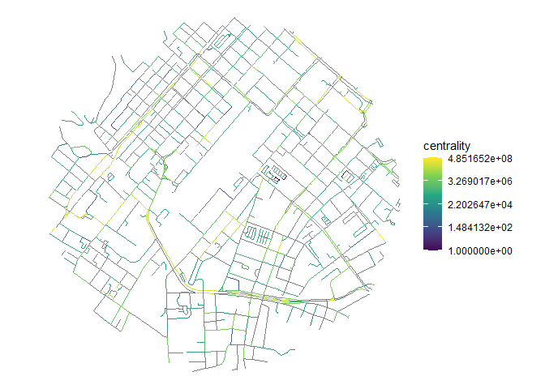

# Modelling traffic in Capetown

    [1] 0.49259

     [1] "geom_num"      "edge_id"       "from_id"       "from_lon"     
     [5] "from_lat"      "to_id"         "to_lon"        "to_lat"       
     [9] "d"             "d_weighted"    "highway"       "lanes"        
    [13] "way_id"        "osm_id"        "lanes"         "lit"          
    [17] "maxspeed"      "oneway"        "time"          "time_weighted"
    [21] "component"     "centrality"   

    # A tibble: 6 × 2
      edge_id centrality
      <chr>        <dbl>
    1 a343708     714162
    2 a343707    1249170
    3 a343704     385548
    4 a343699         25
    5 a343697     601768
    6 a343696     601814

The dataset with the centrality added is as follows:

| geom_num | edge_id | from_id | from_lon | from_lat | to_id | to_lon | to_lat | d | d_weighted | highway | lanes | way_id | osm_id | lanes.1 | lit | maxspeed | oneway | time | time_weighted | component | centrality |
|---:|:---|:---|---:|---:|:---|---:|---:|---:|---:|:---|:---|:---|:---|:---|:---|:---|:---|---:|---:|---:|---:|
| 2596 | a343708 | 4469220754 | 18.41814 | -33.94010 | 36684068 | 18.41834 | -33.93992 | 29.18203 | 58.36406 | residential | 1 | 5364234 | 5364234 | 1 | NA | NA | TRUE | 1.750922 | 3.501843 | 1 | 714162 |
| 11463 | a343707 | 59964704 | 18.44622 | -33.93685 | 59964725 | 18.44371 | -33.93658 | 233.94434 | 467.88869 | residential | 2 | 227878319 | 227878319 | 2 | NA | 60 | FALSE | 14.036661 | 28.073321 | 1 | 1249170 |
| 37783 | a343704 | 2218670211 | 18.47967 | -33.95551 | 2218670332 | 18.47913 | -33.95683 | 458.74564 | 1146.86409 | service | NA | 211943315 | 211943315 | NA | NA | NA | FALSE | 27.524738 | 68.811846 | 1 | 385548 |
| 191 | a343699 | 25392638 | 18.51288 | -33.94234 | 25392222 | 18.51381 | -33.94121 | 154.05001 | 308.10002 | residential | NA | 4245995 | 4245995 | NA | NA | 60 | FALSE | 9.243001 | 18.486001 | 1 | 25 |
| 191 | a343698 | 25392222 | 18.51381 | -33.94121 | 25392638 | 18.51288 | -33.94234 | 154.05001 | 308.10002 | residential | NA | 4245995 | 4245995 | NA | NA | 60 | FALSE | 9.243001 | 18.486001 | 1 | 25 |
| 1155 | a343697 | 26685188 | 18.49099 | -33.96974 | 26685209 | 18.49165 | -33.97025 | 84.70391 | 169.40783 | residential | NA | 4376043 | 4376043 | NA | NA | 60 | FALSE | 5.082235 | 10.164470 | 1 | 601768 |

We can proceed to generate a model of traffic based on the centrality of
the roads if we have a training dataset with traffic data.
